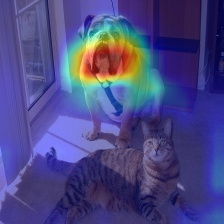

# Visual Explanations for Deep Neural Networks

Deep neural networks (and by extensionl, CNNs) have led to rapid advances in computer vision. 
However, their expressiveness and lack of composability into individually intuitive blocks makes them hard to interpret.  
Given the widespread employment of these networks in myriad applications, understanding their predictions and behaviour becomes increasingly important. 
One approach to understand these networks is to study *Attribution*, i.e. which parts of the input leads to the network activating in a certain way.
This could translate to asking the question: "Which pixels in this image caused the network to classify it as a dog?".

In this project, we will learn and implement some ways of answering this question. 
The rough plan is to study i) saliency maps [1], ii) occlusion sensitivity maps [2], iii) Class Activation Maps (CAM) [3], and iv) Gradient-based CAM [4].
You will also implement these to gain a better, hands-on, understanding. Finally, you will document your learnings in a report. 

		
	

### Structure and Timeline

1. **Reading**. 
You will read and understand i) saliency maps, ii) occlusion sensitivity maps, iii) Class Activation Maps (CAM), and iv) Gradient-based CAM.
Reading the research papers in which these ideas were originally proposed is a useful skill, but sometimes better explanations are available elsewehere
(blog posts, videos, twitter threads). A list of some resources can be found below, but it is by no means exhaustive.   

2. **Progrmaming**.
You will probably find implementations of the techniques you studied online. Feel free to draw from them, but let your vision not wander - the goal here is learning. 
You will code in Python using some deep learning framework like pytorch or tensorflow (preferably pytorch). 

3. **Writing**.
You will submit a short report (< 5 pages, typeset in LaTeX) explaining what you did in the project. 
It is recommeded to *not* leave this till the end, as writing helps crystallize concepts.

The project duration is 15 Dec - 15 Jan. 
It is not much time, so we'll structure the timeline in five-day periods (qweeks: quick week, also quintic means degree 5).
If time permits, we can explore other attribution methods which build on GradCAM (eg. GradCAM++, AblationCAM, etc.). 
On the flip side, we can discuss and skip some stuff if there's a time crunch. But here's a tentative timeline.

| Qweek(s)  | Dates   			| Plan 	 		|
| ----------| ----------------- | -------------	|
| 1,2 		| 16 Dec - 25 Dec 	| Reading		|
| 3,4,5 	| 26 Dec - 10 Jan 	| Programming	|
| 6 		| 11 Jan - 15 Jan	| Writing		| 

### Resources

- Youtube videos
	- Stanford CS230: Deep Learning | Autumn 2018 | Lecture 7 - Interpretability of Neural Network, https://youtu.be/gCJCgQW_LKc 
	- Stanford CS231n: Convolutional Neural Networks for Visual Recognition, 2017, Lecture 12 | Visualizing and Understanding, https://youtu.be/6wcs6szJWMY
	- Visual Saliency: From simple gradient based approach to GradCAM, https://youtu.be/xGZfAoh0xKs 

- Articles / blog posts
	- Grad-CAM: Visual Explanations from Deep Networks, https://glassboxmedicine.com/2020/05/29/grad-cam-visual-explanations-from-deep-networks/  
	- Summary of "Deep Inside Convolutional Networks: Visualising Image Classification Models and Saliency Maps" paper, https://gist.github.com/shagunsodhani/f48da7f77418aa22751ffed115779126 

- Code
	- Class Activation Map methods implemented in Pytorch, https://github.com/jacobgil/pytorch-grad-cam/

### References

[1] Deep Inside Convolutional Networks: Visualising Image Classification Models and Saliency Maps, Karen Simonyan, Andrea Vedaldi, Andrew Zisserman, 2014, https://arxiv.org/abs/1312.6034 
[2] Visualizing and Understanding Convolutional Networks, Matthew D. Zeiler and Rob Fergus, 2013, https://arxiv.org/abs/1311.2901 

[3] Learning Deep Features for Discriminative Localization, Bolei Zhou, Aditya Khosla, Agata Lapedriza, Aude Oliva, Antonio Torralba, 2016, http://cnnlocalization.csail.mit.edu/

[4] Grad-CAM: Visual Explanations from Deep Networks via Gradient-based Localization, Ramprasaath R. Selvaraju, Michael Cogswell, Abhishek Das, Ramakrishna Vedantam, Devi Parikh, Dhruv Batra, 2019, https://arxiv.org/abs/1610.02391 

